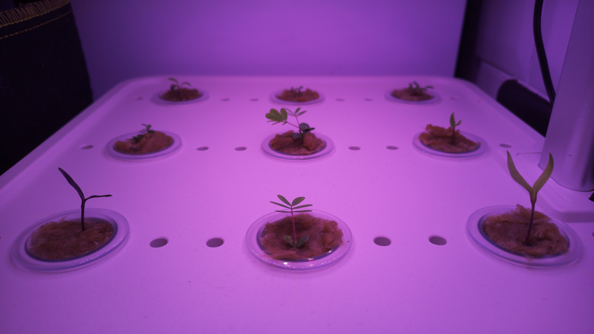

# timelapse

Use a raspberry pi to take still images every 5 minutes and create timelapse videos from them.

### image example



### video example

[video](20230809.mp4)

## setup and notes

rpi venv

```bash
python3.9 -m venv rpi_venv --system-site-packages
source rpi_venv/bin/activate
pip install -e .
```

run the timelapse daemon
```bash
timelapse
```

send a signal to the daemon to take a picture (will move to flask endpoint)
```bash
python src/timelapse/zmq_client_sender.py
```


### notes

create timelapse mp4

```bash
ffmpeg \
    -framerate 24 \
    -pattern_type glob \
    -i "images/*.jpg" \
    -s hd1080 \
    -c:v libx265 \
    -crf 18 \
    -vf "format=yuv420p" \
    output.mp4
```

Given the following directory structure:

```bash
$ ls images/
20230802  20230803  20230804  20230805  20230806
```

The following ffmpeg command will create a video for each day from it's directory:
```bash
for dir in images/*; do
    ffmpeg \
        -framerate 24 \
        -pattern_type glob \
        -i "$dir/*.jpg" \
        -s hd1080 \
        -c:v libx265 \
        -crf 18 \
        -vf "format=yuv420p" \
        "$dir.mp4"
done
```

Move unsorted images
```bash
for file in *.jpg; do
    dir=$(echo "$file" | cut -c 1-8)
    mkdir -p "$dir"
    mv "$file" "$dir"
done
```